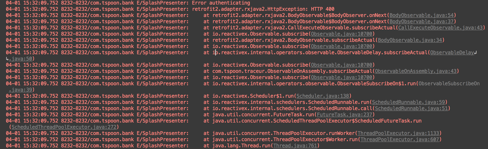
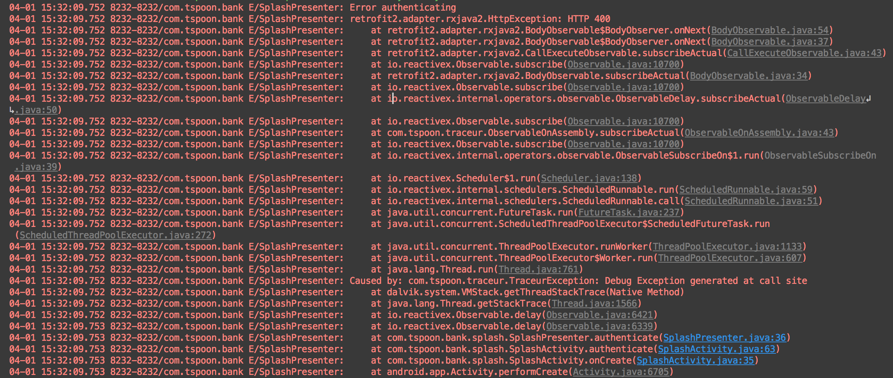

Traceur
=======
Traceur enables easier debugging of RxJava2 exceptions, by appending the source of any asynchronous calls to the
original exception.

An example RxJava exception:


The same exception with Traceur enabled:


Notice that the call site of the asynchronous call is linked in the stack trace (`SplashPresenter`).

RxJava1 had a similar feature included by default, `RxJavaHooks.enableAssemblyTracking()`, but RxJava2 has
no such feature unfortunately.


Usage
-----
Enable logging:
```
Traceur.enableLogging();
```

Disable logging:
```
Traceur.disableLogging();
```

Download
--------
```
compile 'com.tspoon.traceur:traceur:1.0.1'
```


Thanks
------
Thanks to [David Karnok](https://github.com/akarnokd) - this project is largely just an enhancement of his
[RxJava2Extensions](https://github.com/akarnokd/RxJava2Extensions) project, making it slightly easier to consume as a
developer


License
-------

    Copyright 2017 Oisín O'Neill

    Licensed under the Apache License, Version 2.0 (the "License");
    you may not use this file except in compliance with the License.
    You may obtain a copy of the License at

       http://www.apache.org/licenses/LICENSE-2.0

    Unless required by applicable law or agreed to in writing, software
    distributed under the License is distributed on an "AS IS" BASIS,
    WITHOUT WARRANTIES OR CONDITIONS OF ANY KIND, either express or implied.
    See the License for the specific language governing permissions and
    limitations under the License.
